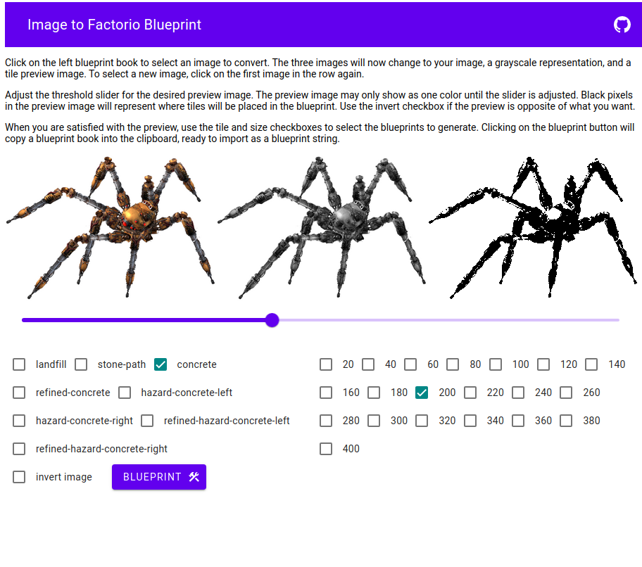

# imgtofactbp

A progressive web app to convert images to factorio tile blueprints.

### Demo 

[https://mlctrez.github.io/imgtofactbp/](https://mlctrez.github.io/imgtofactbp/)

### Action screenshot:

